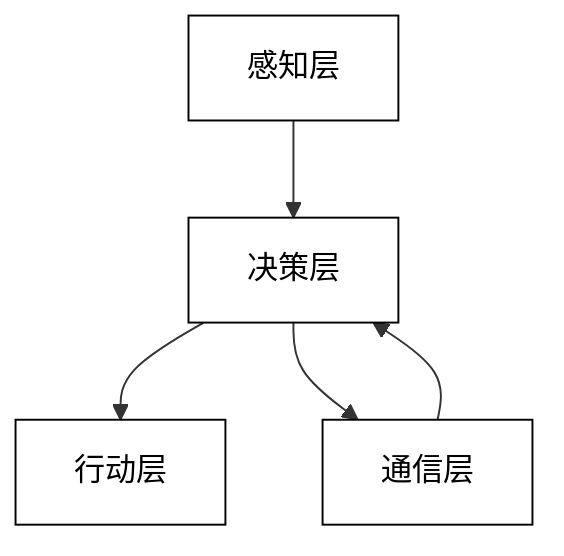

# 第二部分: AI Agent 设计与开发

# 第3章: AI Agent 架构设计

在本章中，我们将深入探讨AI Agent的架构设计。一个良好的架构设计是构建高效、可扩展和鲁棒的AI Agent系统的关键。我们将介绍Agent架构的基本组件、常见的架构模式，以及如何设计多Agent系统。

## 3.1 Agent 架构的基本组件

AI Agent的架构通常包含以下基本组件：感知模块、推理引擎和行动执行模块。这些组件共同工作，使Agent能够感知环境、做出决策并采取行动。

### 3.1.1 感知模块

感知模块负责从环境中收集信息，并将其转换为Agent可以处理的格式。

关键特点：
1. 多模态感知：处理视觉、听觉、触觉等多种输入。
2. 数据预处理：滤波、归一化、特征提取等。
3. 传感器融合：整合多个传感器的数据。

代码示例：简单的多模态感知模块
```python
import numpy as np
from PIL import Image

class PerceptionModule:
    def __init__(self):
        self.visual_processor = self.VisualProcessor()
        self.audio_processor = self.AudioProcessor()

    class VisualProcessor:
        def process(self, image_path):
            image = Image.open(image_path)
            # 简单的图像处理：转换为灰度图并调整大小
            image = image.convert('L').resize((64, 64))
            return np.array(image)

    class AudioProcessor:
        def process(self, audio_data):
            # 简单的音频处理：计算平均振幅
            return np.mean(np.abs(audio_data))

    def perceive(self, visual_input, audio_input):
        visual_features = self.visual_processor.process(visual_input)
        audio_features = self.audio_processor.process(audio_input)
        return {
            'visual': visual_features,
            'audio': audio_features
        }

# 使用示例
perception = PerceptionModule()
result = perception.perceive('image.jpg', np.random.rand(1000))
print("Visual features shape:", result['visual'].shape)
print("Audio feature:", result['audio'])
```

### 3.1.2 推理引擎

推理引擎是Agent的"大脑"，负责处理感知到的信息，做出决策，并生成行动计划。

关键特点：
1. 知识表示：存储和组织Agent的知识和信念。
2. 推理机制：基于规则、概率或神经网络的推理。
3. 学习能力：从经验中更新知识和策略。

代码示例：简单的基于规则的推理引擎
```python
class InferenceEngine:
    def __init__(self):
        self.rules = {
            'sunny': 'go to park',
            'rainy': 'stay at home',
            'cloudy': 'go to mall'
        }
        self.knowledge_base = {}

    def update_knowledge(self, perception):
        self.knowledge_base.update(perception)

    def infer(self):
        weather = self.knowledge_base.get('weather')
        if weather in self.rules:
            return self.rules[weather]
        return 'no action'

# 使用示例
engine = InferenceEngine()
engine.update_knowledge({'weather': 'sunny'})
action = engine.infer()
print("Inferred action:", action)
```

### 3.1.3 行动执行模块

行动执行模块负责将推理引擎的决策转化为具体的行动，并与环境进行交互。

关键特点：
1. 动作映射：将高级决策转换为低级控制命令。
2. 反馈控制：根据执行结果调整行动。
3. 安全机制：确保行动不会危及Agent或环境。

代码示例：简单的行动执行模块
```python
class ActionExecutor:
    def __init__(self):
        self.current_position = [0, 0]
        self.action_map = {
            'move_north': [0, 1],
            'move_south': [0, -1],
            'move_east': [1, 0],
            'move_west': [-1, 0]
        }

    def execute(self, action):
        if action in self.action_map:
            movement = self.action_map[action]
            self.current_position[0] += movement[0]
            self.current_position[1] += movement[1]
            print(f"Executed {action}, new position: {self.current_position}")
        else:
            print(f"Unknown action: {action}")

# 使用示例
executor = ActionExecutor()
executor.execute('move_north')
executor.execute('move_east')
```

这些基本组件共同构成了AI Agent的核心架构。在实际应用中，我们需要根据具体需求对这些组件进行定制和扩展，以构建更复杂、更智能的Agent系统。

## 3.2 常见的 Agent 架构

在AI Agent设计中，有几种常见的架构模式，每种架构都有其特定的优势和适用场景。

### 3.2.1 反应式架构

反应式架构是最简单的Agent架构之一，它直接将感知映射到行动，不需要内部状态或复杂的推理过程。

特点：
1. 快速响应
2. 低计算复杂度
3. 适合简单、明确的任务环境

代码示例：反应式Agent
```python
class ReactiveAgent:
    def __init__(self):
        self.rules = {
            'obstacle_ahead': 'turn_left',
            'goal_in_sight': 'move_forward',
            'no_obstacle': 'move_forward'
        }

    def act(self, perception):
        for condition, action in self.rules.items():
            if perception == condition:
                return action
        return 'do_nothing'

# 使用示例
agent = ReactiveAgent()
print(agent.act('obstacle_ahead'))
print(agent.act('goal_in_sight'))
```

### 3.2.2 分层架构

分层架构将Agent的功能划分为多个层次，每个层次负责不同抽象级别的任务。

特点：
1. 模块化设计
2. 支持不同时间尺度的决策
3. 适合复杂任务和长期规划

代码示例：简单的分层Agent
```python
class LayeredAgent:
    def __init__(self):
        self.reactive_layer = self.ReactiveLayer()
        self.planning_layer = self.PlanningLayer()
        self.decision_layer = self.DecisionLayer()

    class ReactiveLayer:
        def process(self, perception):
            if perception == 'danger':
                return 'evade'
            return None

    class PlanningLayer:
        def process(self, goal):
            return ['move', 'grab', 'move']

    class DecisionLayer:
        def process(self, reactive_action, plan):
            if reactive_action:
                return reactive_action
            return plan.pop(0) if plan else 'wait'

    def act(self, perception, goal):
        reactive_action = self.reactive_layer.process(perception)
        plan = self.planning_layer.process(goal)
        return self.decision_layer.process(reactive_action, plan)

# 使用示例
agent = LayeredAgent()
print(agent.act('normal', 'get_object'))
print(agent.act('danger', 'get_object'))
```

### 3.2.3 BDI 架构

BDI（Belief-Desire-Intention）架构是一种基于人类推理的Agent模型，包含信念（对世界的认知）、欲望（目标）和意图（计划）三个关键组件。

特点：
1. 模拟人类推理过程
2. 支持复杂的目标导向行为
3. 适合动态、不确定的环境

代码示例：简化版BDI Agent
```python
class BDIAgent:
    def __init__(self):
        self.beliefs = set()
        self.desires = set()
        self.intentions = []

    def update_beliefs(self, perception):
        self.beliefs.update(perception)

    def generate_options(self):
        options = set()
        if 'hungry' in self.beliefs:
            options.add('find_food')
        if 'tired' in self.beliefs:
            options.add('rest')
        return options

    def filter_intentions(self, options):
        self.intentions = list(options.intersection(self.desires))

    def execute(self):
        if self.intentions:
            return self.intentions.pop(0)
        return 'do_nothing'

    def step(self, perception):
        self.update_beliefs(perception)
        options = self.generate_options()
        self.filter_intentions(options)
        return self.execute()

# 使用示例
agent = BDIAgent()
agent.desires = {'find_food', 'rest'}
print(agent.step({'hungry'}))
print(agent.step({'tired'}))
```

这些架构为AI Agent的设计提供了不同的思路和方法。在实际应用中，我们通常需要根据具体问题的特性选择合适的架构，或者将多种架构的优点结合起来，以构建更加高效和灵活的Agent系统。

## 3.3 多 Agent 系统设计

多Agent系统（MAS）涉及多个交互的智能Agent，这些Agent可以协作或竞争来解决复杂问题。设计多Agent系统需要考虑Agent间的通信、协作机制以及整体系统的组织结构。

### 3.3.1 多Agent系统（MAS）架构设计模式

#### 概述

多Agent系统（MAS）是一种用于设计和实现复杂分布式系统的架构方法。MAS通过多个自治的智能代理协作来解决问题，这些代理可以感知环境、进行决策并采取行动。本文将深入探讨MAS的架构设计模式，包括其背景、核心概念、算法原理、数学模型、应用案例以及最佳实践。我们将通过详细的代码分析和效果分析来展示MAS在不同领域的应用，并提供相关的拓展阅读资源。
  

多Agent系统（MAS）是一种用于解决复杂问题的分布式系统架构。MAS由多个自治的智能代理组成，这些代理可以独立地感知环境、进行决策并采取行动。MAS的设计灵感来源于自然界中的群体行为，如蚁群、蜂群和鸟群的协作。

MAS的应用领域非常广泛，包括机器人控制、交通管理、供应链管理、金融市场模拟、智能电网等。MAS的优势在于其灵活性、可扩展性和鲁棒性，能够有效应对动态变化的环境和复杂的任务。
 

在MAS中，核心概念包括智能代理、环境、通信、协作和自治。

- **智能代理**：智能代理是MAS的基本构建单元。每个代理具有感知、决策和行动的能力。代理可以是软件实体或物理实体，如机器人。

- **环境**：环境是代理感知和行动的场所。环境可以是物理世界、虚拟世界或混合世界。

- **通信**：代理之间通过通信进行信息交换和协作。通信可以是直接的（如消息传递）或间接的（如通过环境）。

- **协作**：代理通过协作来实现共同的目标。协作可以是显式的（如任务分配）或隐式的（如行为协调）。

- **自治**：代理具有自主决策的能力，可以根据环境变化和自身目标进行调整。
 

MAS的系统架构通常包括以下几个层次：

- **感知层**：负责从环境中获取信息。
- **决策层**：负责根据感知信息进行决策。
- **行动层**：负责执行决策并影响环境。
- **通信层**：负责代理之间的信息交换。


 

代理架构模式是MAS设计的基础。常见的代理架构模式包括：

- **反应式代理**：基于感知-行动规则，快速响应环境变化。
- **认知代理**：具有内部状态和推理能力，能够进行复杂决策。
- **混合代理**：结合反应式和认知特性，兼具快速响应和复杂决策能力。
 

协作模式决定了代理如何协同工作以实现共同目标。常见的协作模式包括：

- **合同网协议**：通过竞标和合同机制进行任务分配。
- **黑板系统**：代理通过共享的黑板进行信息交换和协作。
- **拍卖机制**：通过拍卖方式进行资源分配和任务分配。
 

通信模式决定了代理之间的信息交换方式。常见的通信模式包括：

- **点对点通信**：代理之间直接进行信息交换。
- **广播通信**：代理向所有其他代理发送信息。
- **多播通信**：代理向特定组的代理发送信息。
 

组织模式决定了代理的组织结构和角色分配。常见的组织模式包括：

- **层次结构**：代理按照层次进行组织，上层代理负责协调和管理下层代理。
- **平面结构**：所有代理处于同一层次，具有相同的权利和责任。
- **团队结构**：代理被组织成多个团队，每个团队负责特定的任务或功能。
 

适应性模式决定了代理如何应对环境变化和任务变化。常见的适应性模式包括：

- **学习机制**：代理通过学习算法（如强化学习）来提高性能。
- **进化机制**：代理通过进化算法（如遗传算法）来优化行为。
- **自组织机制**：代理通过自组织机制（如蚁群优化）来实现全局协调。
 

安全与信任模式确保代理系统的安全性和可靠性。常见的安全与信任模式包括：

- **身份认证**：确保代理的身份真实性。
- **访问控制**：限制代理对资源的访问权限。
- **信任管理**：通过信任模型评估代理的可信度。
 

反应式代理通过简单的感知-行动规则进行决策。其核心算法如下：

```plaintext
Algorithm ReactiveAgent
  Input: Perception p
  Output: Action a

  RuleSet R = {r1, r2, ..., rn} // Set of perception-action rules
  for each rule r in R do
    if r.condition(p) is true then
      return r.action
  end for
  return null // No applicable action
```

反应式代理的优点是响应速度快，适用于动态变化的环境。缺点是缺乏长期规划能力。
 

认知代理具有内部状态和推理能力，能够进行复杂决策。其核心算法如下：

```plaintext
Algorithm CognitiveAgent
  Input: Perception p, InternalState s
  Output: Action a

  BeliefSet B = UpdateBeliefs(p, s)
  DesireSet D = GenerateDesires(B)
  IntentionSet I = SelectIntentions(D)
  Plan P = GeneratePlan(I)
  ExecutePlan(P)
  UpdateState(s, P)
```

认知代理的优点是具有复杂决策能力，适用于复杂任务。缺点是计算复杂度高。
 

协作算法用于实现代理之间的协作。以合同网协议为例，其核心算法如下：

```plaintext
Algorithm ContractNet
  Input: Task t
  Output: AssignedAgent a

  AnnounceTask(t)
  Bids = CollectBids()
  BestBid = SelectBestBid(Bids)
  AssignTask(BestBid.agent, t)
```

合同网协议的优点是灵活性高，适用于动态任务分配。缺点是通信开销大。
 

通信协议用于定义代理之间的信息交换格式。以KQML（Knowledge Query and Manipulation Language）为例，其核心协议如下：

```plaintext
Message KQMLMessage
  Performative: String // e.g., "ask", "tell", "achieve"
  Sender: AgentID
  Receiver: AgentID
  Content: String
  Language: String // e.g., "Prolog", "LISP"
  Ontology: String
```

KQML的优点是标准化程度高，适用于异构系统。缺点是学习曲线陡峭。

---

#### 代理决策模型

代理决策模型通常基于马尔可夫决策过程（MDP）。MDP由以下元素组成：

- 状态空间 $S$：代理可能处于的所有状态的集合。
- 动作空间 $A$：代理可能采取的所有动作的集合。
- 状态转移函数 $P(s'|s,a)$：在状态 $s$ 执行动作 $a$ 后转移到状态 $s'$ 的概率。
- 奖励函数 $R(s,a)$：在状态 $s$ 执行动作 $a$ 所获得的即时奖励。

MDP的目标是找到一个策略 $\pi: S \rightarrow A$，使得累积奖励最大化。累积奖励通常通过折扣因子 $\gamma$ 进行计算：

$$
V^\pi(s) = \mathbb{E}\left[\sum_{t=0}^{\infty} \gamma^t R(s_t, a_t) \mid s_0 = s, \pi\right]
$$

其中，$V^\pi(s)$ 是状态 $s$ 的价值函数，表示从状态 $s$ 开始并遵循策略 $\pi$ 所能获得的期望累积奖励。
 

在MAS中，强化学习（RL）常用于代理的自适应行为。RL的核心是通过试错学习最优策略。Q-learning 是一种常用的无模型RL算法，其更新公式为：

$$
Q(s, a) \leftarrow Q(s, a) + \alpha \left[ R(s, a) + \gamma \max_{a'} Q(s', a') - Q(s, a) \right]
$$

其中，$Q(s, a)$ 是状态-动作对的价值函数，$\alpha$ 是学习率，$\gamma$ 是折扣因子。
 

在多代理系统中，博弈论模型用于分析代理之间的交互。常见的博弈模型包括：

- **零和博弈**：一个代理的收益等于另一个代理的损失。
- **合作博弈**：代理通过合作实现共同利益。
- **非合作博弈**：代理独立决策以最大化自身利益。

纳什均衡是非合作博弈中的一个重要概念，表示在给定策略组合下，任何代理都无法通过单方面改变策略而获得更高收益。

---

#### 应用案例分析

在机器人协作中，MAS用于协调多个机器人完成复杂任务。例如，在仓库管理中，多个机器人需要协作搬运货物。通过MAS，机器人可以动态分配任务、避免碰撞并优化路径。


在一个典型的仓库管理系统中，机器人通过合同网协议进行任务分配。每个机器人作为一个智能代理，具有感知、决策和行动能力。系统通过以下步骤实现协作：

1. **任务发布**：中央控制系统发布搬运任务。
2. **竞标**：机器人根据自身状态和位置进行竞标。
3. **任务分配**：中央控制系统选择最佳竞标者并分配任务。
4. **执行任务**：机器人执行任务并反馈状态。

通过这种方式，系统能够高效地管理多个机器人，提高仓库运作效率。
 

在智能交通管理中，MAS用于优化交通流量和减少拥堵。例如，交通信号灯作为智能代理，通过感知交通流量动态调整信号时长。
 

在一个城市交通管理系统中，交通信号灯通过MAS进行协作。每个信号灯作为一个智能代理，具有以下功能：

1. **感知交通流量**：通过传感器获取实时交通数据。
2. **决策信号时长**：根据交通流量和历史数据调整信号时长。
3. **通信与协作**：与邻近信号灯通信，协调信号切换。

通过这种方式，系统能够动态优化交通流量，减少车辆等待时间和交通拥堵。
 

在智能电网中，MAS用于管理分布式能源资源和优化电力分配。例如，家庭能源管理系统通过MAS协调太阳能电池板、储能设备和电力消耗。
 

在一个智能电网系统中，家庭能源管理系统作为智能代理，具有以下功能：

1. **感知能源状态**：监测太阳能发电、储能设备状态和电力消耗。
2. **决策能源分配**：根据能源状态和电价调整能源使用策略。
3. **通信与协作**：与电网和其他家庭系统通信，优化能源交易。

通过这种方式，系统能够提高能源利用效率，降低能源成本并支持可再生能源的使用。

---

#### 项目小结与最佳实践


多Agent系统（MAS）通过多个自治的智能代理协作解决复杂问题，具有灵活性、可扩展性和鲁棒性。MAS的架构设计模式包括代理架构模式、协作模式、通信模式、组织模式、适应性模式和安全与信任模式。MAS在机器人协作、智能交通管理和智能电网等领域中展现了广泛的应用潜力。通过详细的算法分析和数学模型，我们可以更好地理解和实现MAS的功能。

在设计和实现MAS时，以下最佳实践可以帮助提高系统的性能和可靠性：

1. **明确代理角色和职责**：在系统设计初期，明确每个代理的角色和职责，以避免功能重叠和冲突。

2. **选择合适的通信协议**：根据系统需求选择合适的通信协议，确保代理之间的信息交换高效且可靠。

3. **优化协作机制**：根据任务特性选择合适的协作机制，如合同网协议或拍卖机制，以提高任务分配效率。

4. **实现自适应行为**：通过强化学习或进化算法实现代理的自适应行为，提高系统在动态环境中的适应性。

5. **确保系统安全性**：通过身份认证、访问控制和信任管理等机制，确保系统的安全性和可靠性。

6. **进行性能评估和优化**：定期进行系统性能评估，识别瓶颈并进行优化，以提高系统的整体效率。

---

#### 拓展阅读与资源

为了进一步深入了解多Agent系统（MAS）及其架构设计模式，以下是一些推荐的拓展阅读和资源：

1. **书籍推荐**：
    - "Multiagent Systems: Algorithmic, Game-Theoretic, and Logical Foundations" by Yoav Shoham and Kevin Leyton-Brown
    - "An Introduction to MultiAgent Systems" by Michael Wooldridge

2. **学术论文**：
    - "A Survey of Multi-Agent Systems" by Peter Stone and Manuela Veloso
    - "Coordination of Multiple Agents in Dynamic Environments" by Katia Sycara

3. **在线课程**：
    - Coursera上的"Multi-Agent Systems"课程
    - edX上的"Introduction to Multi-Agent Systems"课程

4. **开源项目**：
    - JADE (Java Agent DEvelopment Framework)：一个用于开发多Agent系统的开源平台。
    - MASON：一个多Agent仿真工具包，适用于大规模Agent仿真。

5. **社区与论坛**：
    - Stack Overflow上的多Agent系统标签
    - Reddit的r/MultiAgentSystems社区

通过这些资源，读者可以进一步探索MAS的理论基础、技术实现和实际应用，提升在该领域的专业知识和技能。


### 3.3.2 Agent 间通信协议

Agent间的有效通信是多Agent系统成功的关键。通信协议定义了Agent之间交换信息的方式和格式。

关键考虑因素：
1. 消息格式：如FIPA ACL（Agent Communication Language）
2. 通信模式：点对点、广播、发布-订阅等
3. 语义互操作性：确保不同Agent能理解彼此的消息

代码示例：简单的Agent通信系统
```python
import queue

class Message:
    def __init__(self, sender, receiver, content):
        self.sender = sender
        self.receiver = receiver
        self.content = content

class CommunicationSystem:
    def __init__(self):
        self.message_queues = {}

    def register_agent(self, agent_id):
        self.message_queues[agent_id] = queue.Queue()

    def send_message(self, message):
        if message.receiver in self.message_queues:
            self.message_queues[message.receiver].put(message)

    def receive_message(self, agent_id):
        if agent_id in self.message_queues and not self.message_queues[agent_id].empty():
            return self.message_queues[agent_id].get()
        return None

class Agent:
    def __init__(self, agent_id, comm_system):
        self.id = agent_id
        self.comm_system = comm_system
        self.comm_system.register_agent(self.id)

    def send_message(self, receiver, content):
        message = Message(self.id, receiver, content)
        self.comm_system.send_message(message)

    def receive_message(self):
        return self.comm_system.receive_message(self.id)

# 使用示例
comm_system = CommunicationSystem()
agent1 = Agent("Agent1", comm_system)
agent2 = Agent("Agent2", comm_system)

agent1.send_message("Agent2", "Hello, Agent2!")
received_message = agent2.receive_message()
if received_message:
    print(f"{received_message.receiver} received: {received_message.content} from {received_message.sender}")
```

### 3.3.3 协作与竞争机制

在多Agent系统中，Agent可能需要协作以实现共同目标，或者竞争有限资源。设计适当的协作和竞争机制对系统的整体性能至关重要。

协作机制：
1. 任务分解与分配
2. 共享知识库
3. 协商和共识达成

竞争机制：
1. 拍卖和市场机制
2. 博弈论方法
3. 资源分配策略

代码示例：简单的任务分配系统
```python
import random

class Task:
    def __init__(self, task_id, difficulty):
        self.id = task_id
        self.difficulty = difficulty

class Agent:
    def __init__(self, agent_id, capability):
        self.id = agent_id
        self.capability = capability
        self.current_task = None

    def bid(self, task):
        if self.current_task is None:
            return self.capability / task.difficulty
        return 0

    def assign_task(self, task):
        self.current_task = task

class TaskAllocationSystem:
    def __init__(self):
        self.agents = []
        self.tasks = []

    def add_agent(self, agent):
        self.agents.append(agent)

    def add_task(self, task):
        self.tasks.append(task)

    def allocate_tasks(self):
        for task in self.tasks:
            bids = [(agent, agent.bid(task)) for agent in self.agents]
            best_agent, highest_bid = max(bids, key=lambda x: x[1])
            if highest_bid > 0:
                best_agent.assign_task(task)
                print(f"Task {task.id} assigned to Agent {best_agent.id}")
            else:
                print(f"Task {task.id} could not be assigned")

# 使用示例
system = TaskAllocationSystem()
for i in range(5):
    system.add_agent(Agent(f"Agent{i}", random.uniform(0.5, 1.5)))
for i in range(3):
    system.add_task(Task(f"Task{i}", random.uniform(0.5, 1.5)))

system.allocate_tasks()
```

### 3.3.4 分布式问题解决

多Agent系统的一个主要优势是能够解决分布式问题。这涉及将复杂问题分解为子问题，由不同的Agent并行解决，然后整合结果。

关键考虑因素：
1. 问题分解策略
2. 子问题分配
3. 结果整合方法
4. 冲突解决机制

代码示例：分布式计算平均值
```python
import random

class ComputeAgent:
    def __init__(self, agent_id):
        self.id = agent_id
        self.local_data = []
        self.neighbors = []
        self.average = 0

    def add_neighbor(self, neighbor):
        self.neighbors.append(neighbor)

    def generate_local_data(self):
        self.local_data = [random.randint(1, 100) for _ in range(5)]
        self.average = sum(self.local_data) / len(self.local_data)

    def update_average(self):
        neighbor_averages = [neighbor.average for neighbor in self.neighbors]
        all_averages = neighbor_averages + [self.average]
        self.average = sum(all_averages) / len(all_averages)

class DistributedAverageSystem:
    def __init__(self, num_agents):
        self.agents = [ComputeAgent(i) for i in range(num_agents)]
        self.setup_neighbors()

    def setup_neighbors(self):
        for i, agent in enumerate(self.agents):
            left_neighbor = self.agents[(i - 1) % len(self.agents)]
            right_neighbor = self.agents[(i + 1) % len(self.agents)]
            agent.add_neighbor(left_neighbor)
            agent.add_neighbor(right_neighbor)

    def compute_distributed_average(self, iterations):
        for agent in self.agents:
            agent.generate_local_data()

        for _ in range(iterations):
            for agent in self.agents:
                agent.update_average()

        global_average = sum(agent.average for agent in self.agents) / len(self.agents)
        return global_average

# 使用示例
system = DistributedAverageSystem(5)
result = system.compute_distributed_average(10)
print(f"Computed distributed average: {result}")
```

这些多Agent系统设计方法和技术为解决复杂、分布式问题提供了强大的工具。在实际应用中，我们需要根据具体问题的特性选择合适的通信协议、协作机制和问题解决策略，以构建高效、可扩展的多Agent系统。

通过本章，我们深入探讨了AI Agent的架构设计，包括基本组件、常见架构模式以及多Agent系统设计。这些知识为构建复杂、智能的AI Agent系统奠定了基础。在接下来的章节中，我们将继续探讨如何实现这些架构，并将它们应用到实际问题中。
